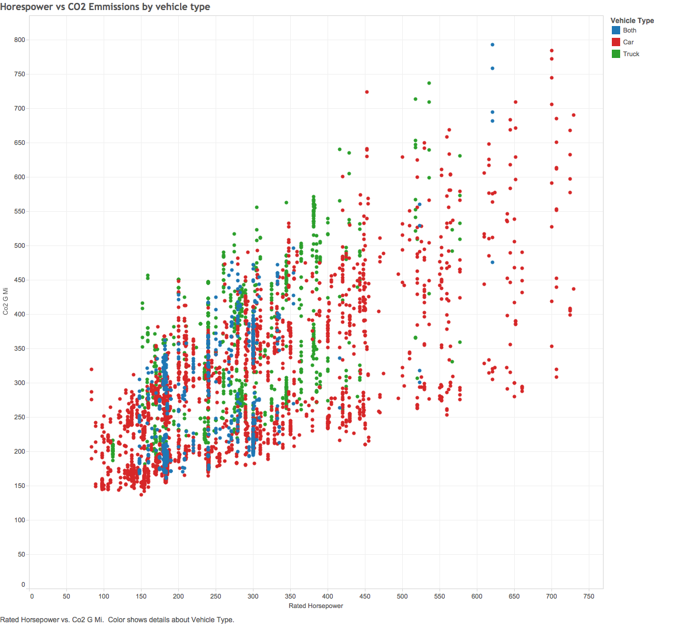
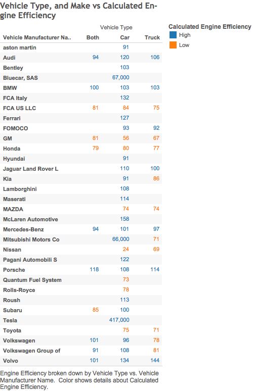
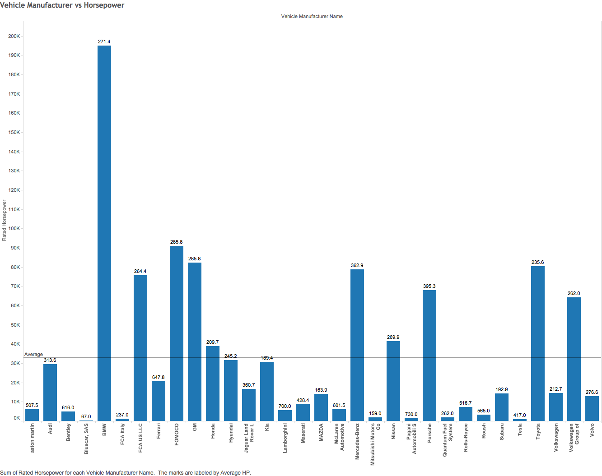

 

#### This html page, produced by creating an R markdown document, and using KnitR to knit the file into html. The purpose of this html file, is to show our analysis of our data set in Tableau. The data set is test car information including, horse power, emissions, engine size, and safety ratings . This html also shows the steps required to reproduce our findings, given the same data. Given the variables in our data set, we were able to query the data base in a few different ways and use Tableau to create visualizations to better analyze the data. The tableau graphs, are then saved as images and inserted into this html through the .rmd file.

#### Tableau Scatter Plot:
Below is our first visualization of a subset of the data. The graph is a scatter plot showing horse power on the x-axis and CO2 emissions on the y-axis. As expected there is a positive correlation between the two measure variables. The visualization shows a trend of increased carbon dioxide emissions with increases in horesepower. The colors represent different vehicle types.

 

#### Tableau Cross-tab:
Below is another visualization of a subset of the data. For this visualization, we wanted to observe a cross tab of vehicle types, car makes, and the calculated engine efficiency of the vehicles. Engine efficiency was calculated by dividing the horsepower by the engine displacement, or size of the engine in Liters. Parameters were set for high and low engine efficiency and used to compare all of the vehicles in the cross-tab.

#### Tableau Bar Graph:
Below is our third visualizations of the data. We wanted do see a Bar Chart of the Vehicule Manufacturer vs Sum of Horsepower, and see how car models compared with competitors in most Horsepower in their fleet. We added a trendline as well so we can see which models produced more total Horsepower in their cars. Finally we labeled each bar with the average Horsepower for a car with their model. Our Data showed that while BMW had the largest fleet with the most total Horsepower, Lamborghini had the highest average Horsepower rating per car.

